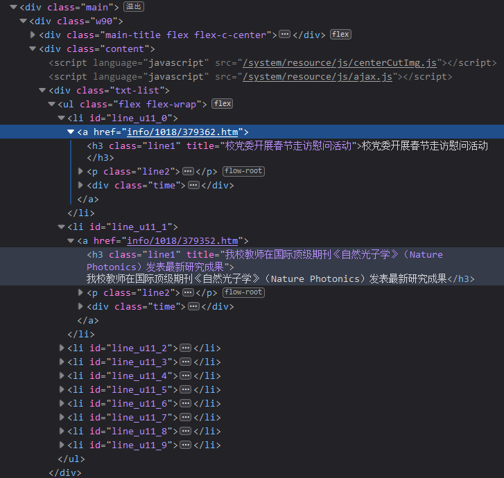

# 环境
- 阿里云 2C 4G
- OS: Ubuntu 22.04.3 LTS
- Docker: 25.0.2
- Python: 3.8.18
- Mariadb: latest

# Py爬虫

## 对html进行分析

- 新闻块的id为 `line_u11_<num>` 0-9 共十个
  - 标题`title`
  - 链接`herf`
    - 完整的链接为 `https://news.hqu.edu.cn/<herf>`

# Web